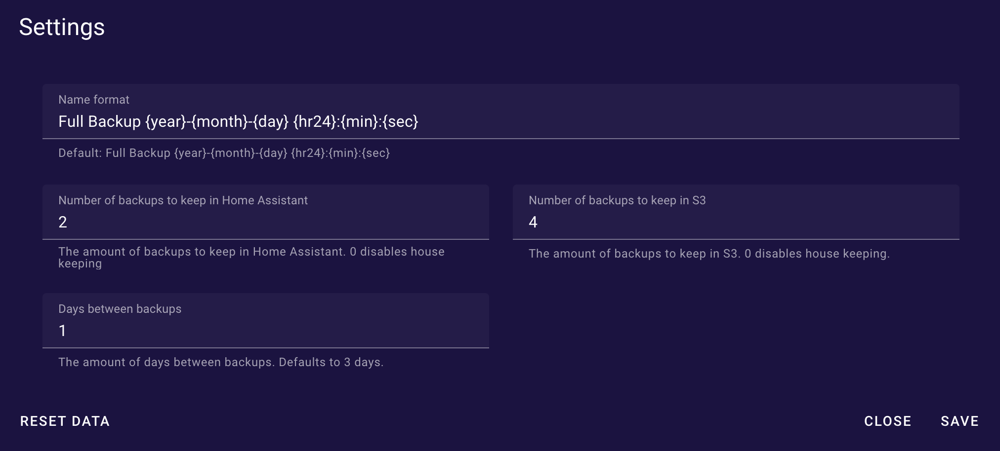

# Home Assistant S3 Backup

## Overview

Home Assistant S3 Backup allows for automated scheduling and synchronization of Home Assistant backups to any S3 compatible storage.

> [!WARNING]
> This plugin is still in early development and should be considered alpha software. While I've been using it in my own Home Assistant installation a while without issues, please use it at your own risk. It's unclear how much development will go into this plugin.
>
> If you're just looking for an easy backup solution for Home Assistant and don't mind using Google Drive you probably want to use [Home Assistant Google Drive Backup](https://github.com/sabeechen/hassio-google-drive-backup) in favor of this.

## Features

🌟 Web UI to manage backup and scheduling 
📆 Creates backups on a configurable schedule 
♻️ Sync backups to S3 
🧹 Housekeeping of old backups 

## Limitations

It's still early days so a lot.. Some of the most noteworthy:

- **No sensors or monitoring**
  - The addon doesn't create any sensors in Home Assistant or provide other means for monitoring the backup.
- **No generational backups**
  - Backups can be pinned to prevent deletion but there's no support for generational backups.
- **Only supports full backups and restores.**
  - All partial backups are ignored for now. Partial restore can be done from Home Assistants own interface if needed.
- **Handles all full backups, even the ones created outside of the addon.**
  - Any full backup in home assistant will be recognized by the addon and synced to S3.

## Installation

1. **Add Repository to Home Assistant:**

Click the big blue button.

Or manually:

- Navigate to the Add-on Store in your Home Assistant UI: `Settings` -> `Add-ons` -> `Add-on Store`.
- Click the 3-dots in the upper right corner, select `Repositories`, and paste in this URL: [https://github.com/prankstr/hassio-s3-backup](https://github.com/prankstr/hassio-s3-backup).

2. **Install Home Assistant S3 Backup**
   - Refresh the page
   - Find Home Assistant S3 Backup in the list of available add-ons, open it and click 'Install'.

## Configuration

Before starting, the addon needs to be configured with the following settings:

- `log_level`: Set the logging level (options: "Info", "Debug", "Warn", "Error"; default: "Info").
- `s3_bucket`: Name of bucket in S3 where backups will be stored(default: "Home Assistant Backups")
- `s3_endpoint`: The endpoint for the S3 compatible storage.
- `s3_access_key_id`: The S3 Access key ID.
- `s3_secret_access_key`: The S3 Secret Access Key.

When the addon is running backup related setting can be configured from the UI. It should be pretty self-explanatory but here's a quick rundown of the settings:

- **Name format**: The format of the name of the backup. Supports placeholders for date and time(default: Full Backup {year}-{month}-{day} {hr24}:{min}:{sec})
- **Number of backups keep keep in S3**: The number of backups to keep in S3 before deleting the oldest ones(default: 0)
- **Number of backups keep keep in Home Assistant**: The number of backups to keep in Home Assistant before deleting the oldest ones(default: 0)
- **Days between backups:** The number of days between backups(default: 3)

> [!NOTE]
> Number of backups to keep is initially set to 0 for both S3 and Home Assistant. This means that no backups will be deleted and is a safe guard to prevent unwanted deletion of backups when enabling the addon for the first time.
>
> It's recommended to set these to a reasonable value to avoid running out of storage. As soon as you set a number the addon will remove any full backups exceeding this number.

